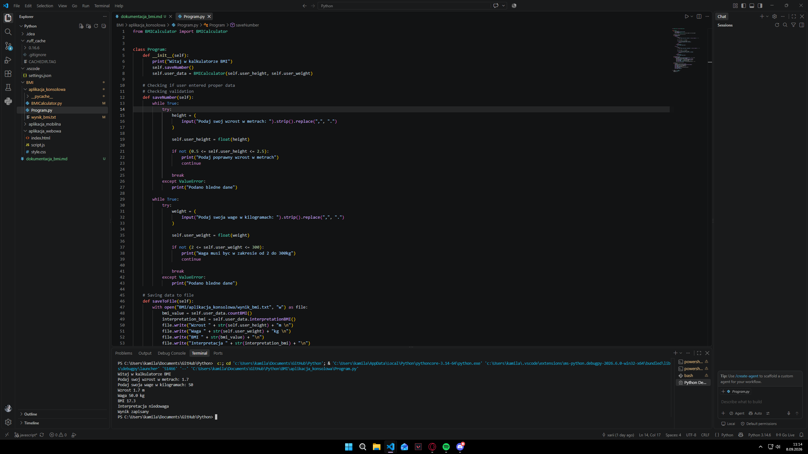
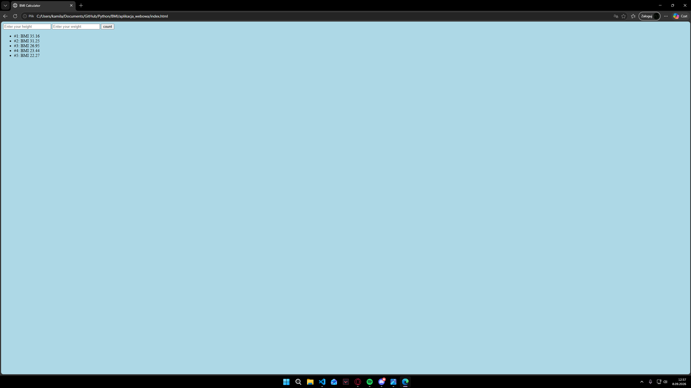
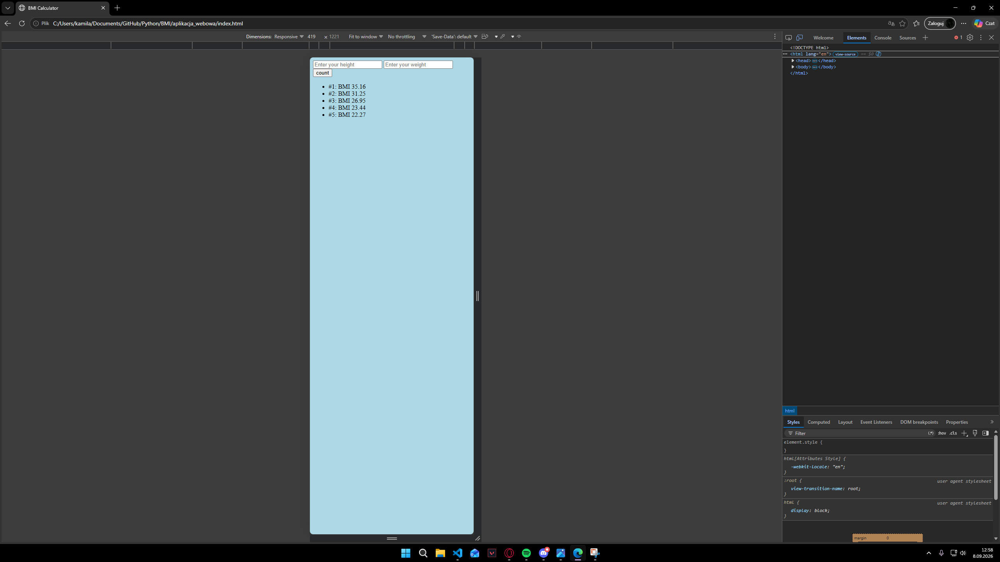
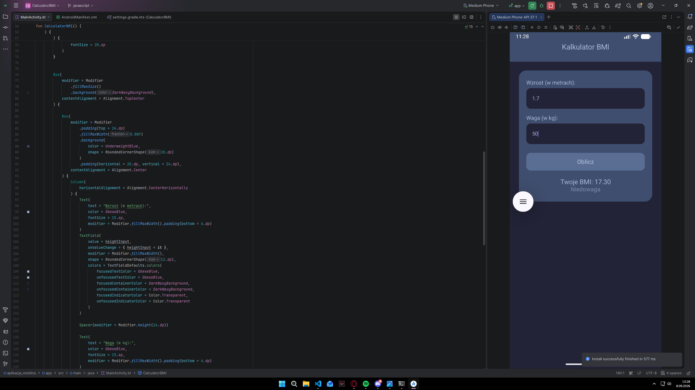
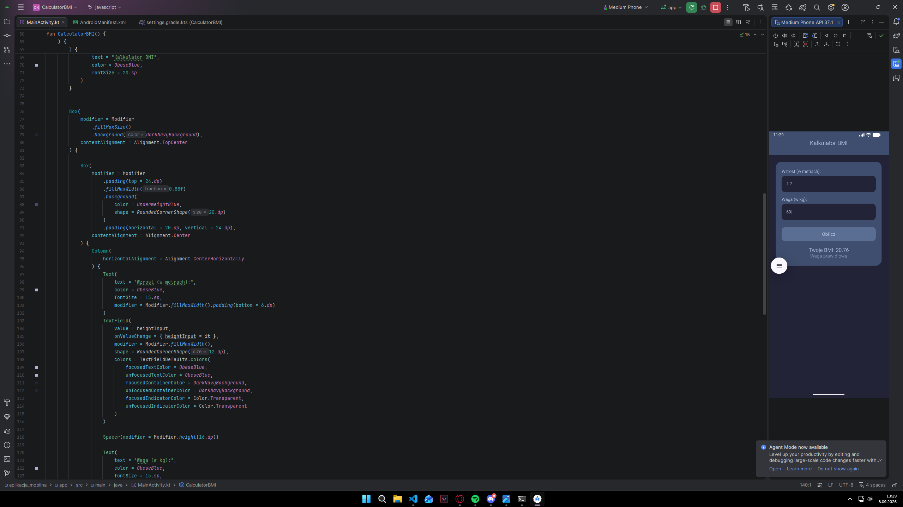

# Dokumentacja aplikacji BMI

* Kamila Wydra
* 0000000000000000
* 08.09.2026

## Spis treści

* Opis działania aplikacji konsolowej
* Opis aplikacji webowej:
* Opis aplikacji mobilnej:

## Opis działania aplikacji konsolowej

### Pseudokod metody countBMI

**Nazwa:** `countBMI`
**Dane wejściowe:**

* `_height` - wzrost w metrach (liczba rzeczywista)
* `_weight` - waga w kilogramach (liczba rzeczywista)

**Wartość zwracana:**

* `BMI` - wskażnik masy ciała zaokrąglony do 2 miejsc po przecinku (liczba rzeczywista)

``` text
Funkcja countBMI():
    1. Oblicz wskaźnik masy ciała: Bmi <- _weight * (_height * _height)
    2. Zaokrąglij wynik do 2 miejsc
    4. Zwróć wynik
```

### Opis walidacji python

**Walidacja wzrostu:**

``` text
Funkcja height():
    * Funkcja pobiera wartość wzrost podaną przez użytkownika
    * Sprawdza czy wartość nie jest mniejsza lub równa od 0.5 metra oraz czy wartość nie jest większa lub równa 2.5 metra
    * W przypadku jeżeli walidacja jest błedna, funkcja zwraca błąd
    * W przypadku jeżeli walidacja jest poprawna, funkcja zwraca wartość
```

**Walidacja wagi:**

``` text
Funkcja weight():
    * Funkcja pobiera wartość wzrost podaną przez użytkownika
    * Sprawdza czy wartość nie jest mniejsza lub równa od 2 kg oraz czy wartość nie jest większa lub równe 300 kg
    * W przypadku jeżeli walidacja jest błedna, funkcja zwraca błąd
    * W przypadku jeżeli walidacja jest poprawna, funkcja zwraca wartość
```

### Zrzut ekranu działającej aplikacji konsolowej



## Opis aplikacji webowej

### Zrzut ekranu działającej aplikacji webowej



### Opis walidacji javascript

``` text
**Walidacja danych:**
  * Weryfikacja poprawności numerycznej funkcją `isNaN()`.
  * Sprawdzenie zakresu wzrostu: $[0{,}5; 2{,}5]\text{ m}$.
  * Sprawdzenie zakresu wagi: $[2; 300]\text{ kg}$.
  * W przypadku błędu: wyświetlenie czerwonego komunikatu `"Wprowadź poprawne dane!"` i natychmiastowe przerwanie działania (`return`).
```

### Zrzut ekranu działającej aplikacji webowej z responsywnością



## Opis aplikacji mobilnej

### Zrzut ekranu działającej aplikacji mobilnej



### Opis walidacji kotlin

``` text
**Walidacja danych:**
  * Weryfikacja poprawności numerycznej funkcją `isNaN()`.
  * Sprawdzenie zakresu wzrostu: $[0{,}5; 2{,}5]\text{ m}$.
  * Sprawdzenie zakresu wagi: $[2; 300]\text{ kg}$.
  * W przypadku błędu: wyświetlenie czerwonego komunikatu `"Wprowadź poprawne dane!"` i natychmiastowe przerwanie działania (`return`).
```

### Zrzut ekranu działającej aplikacji mobilnej z responsywnością



## Opis testów

## Instrukcja

### Aplikacja konsolowa (Python)

**Wymagania wstępne: Zainstalowany interpreter Python 3.x na stanowisku egzaminacyjnym.**
Sposób I Uruchomienie przez terminal (wiersz poleceń / PowerShell)

Otwórz terminal w katalogu projektu

``` text
Bash
cd katalog_zdajacego/aplikacja_konsolowa
```

Uruchom plik główny programu

``` text
Bash
python Program.py
```

(lub python3 Program.py w zależności od konfiguracji systemu).

Postępuj zgodnie z instrukcjami w konsoli:

* Wprowadź wzrost w metrach (np. 1.75).
* Wprowadź masę ciała w kilogramach (np. 70).
* Po obliczeniu wskaźnika BMI plik z raportem wynik_bmi.txt wygeneruje się automatycznie w tym samym katalogu.

Sposób II: Uruchomienie w środowisku IDE (VS Code / PyCharm)

* Otwórz folder aplikacja_konsolowa w edytorze.
* Otwórz plik Program.py.
* Użyj skrótu F5 (Run/Debug) lub kliknij ikonę trójkąta Run Python File w prawym górnym rogu.

### Aplikacja webowa (HTML / CSS / JavaScript)

**Wymagania wstępne: Dowolna nowoczesna przeglądarka internetowa (Google Chrome, MS Edge, Firefox).**

Uruchomienie bezpośrednie:

* Przejdź do folderu katalog_zdajacego/aplikacja_webowa/.
* Kliknij dwukrotnie lewym przyciskiem myszy na plik index.html.
* Aplikacja otworzy się w domyślnej przeglądarce internetowej.

Uruchomienie przez Live Server (VS Code):

* Otwórz katalog aplikacja_webowa w Visual Studio Code.
* Kliknij prawym przyciskiem myszy na plik index.html i wybierz opcję Open with Live Server (skrót: Alt + L, Alt + O).

Obsługa aplikacji:

* Wpisz wzrost w centymetrach (zgodnie z założeniem arkusza webowego) oraz masę w kilogramach.
* Kliknij przycisk „Oblicz BMI”.
* Wynik wraz z interpretacją kolorystyczną pojawi się na ekranie, a ostatnie 5 pomiarów zostanie odświeżone na liście historii pobieranej z pamięci localStorage.

### Aplikacja mobilna (Android Studio)

**Wymagania wstępne: Zainstalowane środowisko Android Studio wraz ze skonfigurowanym urządzeniem wirtualnym (AVD) lub fizycznym telefonem z włączonym trybem debugowania USB.**

Uruchom program Android Studio.

* W menu głównym wybierz File -> Open..., a następnie wskaż katalog projektu aplikacji mobilnej (katalog_zdajacego/aplikacja_mobilna).
* Poczekaj na zakończenie synchronizacji projektu przez narzędzie Gradle (pasek postępu na dolnym pasku stanu).
* Uruchom emulator Androida za pomocą Device Manager lub upewnij się, że jest on wybrany na górnym pasku narzędzi.
* Kliknij zielony przycisk Run 'app' (zielony trójkąt) na górnym pasku lub użyj skrótu klawiszowego Shift + F10.

Po zainstalowaniu aplikacji na emulatorze:

* Wprowadź dane do pól tekstowych.
* Wciśnij przycisk kalkulacji BMI.
